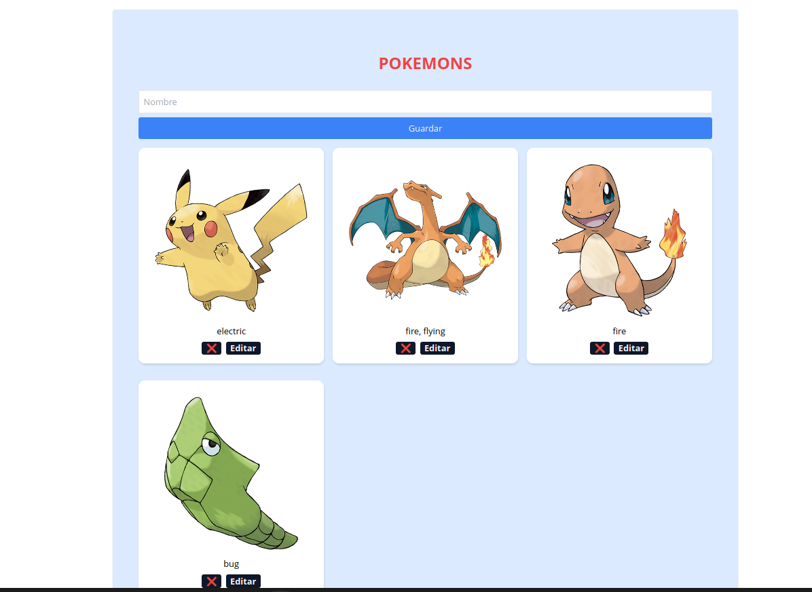

# Frontend Pokémon CRUD

Aplicación web desarrollada con React para gestionar una lista de Pokémon mediante operaciones CRUD.

Este proyecto permite visualizar, crear, editar y eliminar Pokémon desde una interfaz web. El frontend se conecta con un backend desarrollado en Node.js y Express, y también consulta la PokeAPI para obtener información como imagen y tipo del Pokémon.

---
## Captura del proyecto



## Tecnologías utilizadas

- React
- JavaScript
- CSS
- Vite
- Fetch API
- Git y GitHub

---

## Funcionalidades

- Listar Pokémon registrados
- Crear nuevos Pokémon
- Editar información de un Pokémon
- Eliminar Pokémon
- Mostrar nombre, tipo e imagen
- Consumir datos desde una API externa
- Conectarse con un backend propio mediante peticiones HTTP

---

## Proyecto relacionado

Este frontend trabaja junto con el backend del proyecto:

[Backend Pokémon](https://github.com/Karen1007-star/backend-pokemon)

---

## Instalación y ejecución

### 1. Clonar el repositorio

```bash
git clone https://github.com/Karen1007-star/frontend-pokemon.git
```

### 2. Entrar al proyecto

```bash
cd frontend-pokemon
```

### 3. Instalar dependencias

```bash
npm install
```

### 4. Ejecutar el proyecto

```bash
npm run dev
```

### 5. Abrir en el navegador

```bash
http://localhost:5173
```

> Importante: para que la aplicación funcione correctamente, el backend debe estar ejecutándose en `http://localhost:4000`.

---

## Estructura principal

```txt
src/
├── App.jsx
├── CrearPokemon.jsx
├── ListaPokemons.jsx
├── EditarPokemon.jsx
├── EliminarPokemon.jsx
├── App.css
└── main.jsx
```

---

## Aprendizajes del proyecto

Con este proyecto practiqué:

- Creación de componentes en React
- Manejo de estado con useState
- Uso de useEffect para cargar datos
- Peticiones HTTP con fetch
- Renderizado de listas
- Formularios controlados
- Comunicación entre frontend y backend
- Operaciones CRUD desde una interfaz web
- Consumo de una API externa

---

## Estado del proyecto

Proyecto en desarrollo y mejora continua como parte de mi portafolio Fullstack Junior.
